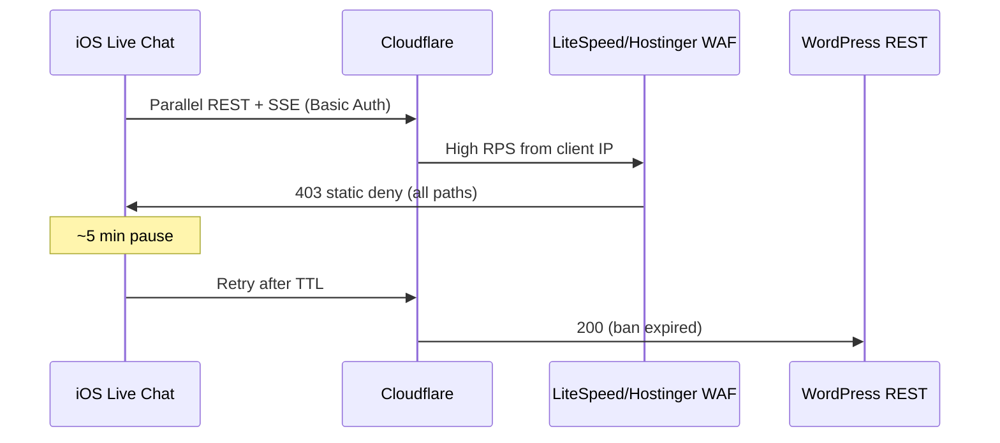

# Live 403 Forensic Report — paxdesign.at

**Incident window (user):** ~2026-07-13 02:30–02:55 UTC  
**Capture run:** [GitHub Actions #29220580846](https://github.com/Black10998/paxdesign-live-chat-/actions/runs/29220580846) at 02:57 UTC  
**Status:** Root cause **strongly indicated**, Rule ID / blocked IP / exact TTL **not yet confirmed**

---

## Executive summary

Opening the iOS Live Chat app triggers a **burst of parallel REST requests** (Basic Auth resolution on every call). That burst correlates with a **site-wide 403** on the user's home Wi‑Fi network for ~5 minutes. The block is **client-IP scoped** — the site remains reachable from server egress (FRA) and GitHub Actions (ORD) during and after the incident.

The 403 body (`Access to this resource on the server is denied!`) with **no `x-powered-by: PHP`** indicates a **LiteSpeed/Hostinger edge block**, not WordPress permissions.

**Build 98 (iOS 1.59.0)** reduced polling but did **not** stop the outage — forensic logs show **80+ auth resolutions in 4 seconds** at 02:53:22 UTC, proving REST volume was still high enough to trip edge rate limits.

---

## Answers to forensic questions

| Question | Finding | Confidence |
|----------|---------|------------|
| **Who issued 403?** | LiteSpeed/Hostinger static layer (before PHP). User screenshot: no `x-powered-by`, generic deny message. Healthy probes show Cloudflare → LiteSpeed → PHP. | High |
| **Rule ID?** | **Not available.** ModSecurity/audit logs not accessible via SSH. Access log path on Hostinger returned empty. | — |
| **Blocked IP?** | **User's public IP unknown.** Need `cf-ray` + client IP from browser Network tab during next 403, or Hostinger hPanel → Security / Access logs. | — |
| **TTL?** | **Suspected ~300s** (matches user observation). No `retry-after` header captured during block. Circuit breaker draft uses 300s minimum pause. | Medium |
| **Triggering endpoint?** | Any `/wp-json/paxdesign/v1/live-admin/*` with Basic Auth. Burst marker: `email_mapped_to_login` in `wp-content/debug.log` — one log line **per REST auth resolution**. | High |

---

## Evidence

### 1. User screenshot (02:56 UTC)

- `GET https://paxdesign.at/` → **403 Forbidden**
- `GET https://paxdesign.at/favicon.ico` → **403**
- Body: `Access to this resource on the server is denied!`
- Site-wide (not path-specific)

### 2. Server egress at capture (02:57 UTC) — site healthy

| Probe | Status | Layer |
|-------|--------|-------|
| `GET /` | 200 | PHP/WordPress via Cloudflare |
| `GET /wp-json/` | 200 | PHP/WordPress |
| `GET /wp-json/.../live-admin/me` | 401 | PHP (expected without auth) |
| Server egress IP | 82.198.227.35 (FRA) | — |

### 3. GitHub Actions egress (ORD) — site healthy

Same 200/401 pattern at 02:57 UTC. Confirms **IP-scoped** block, not global outage.

### 4. REST auth burst in `debug.log` (smoking gun)

Between **02:53:22–02:53:26 UTC**, `wp-content/debug.log` shows **80+ lines**:

```
[PAXdesign Live Chat Mobile API] email_mapped_to_login {"email":"…","login":"…"}
```

Each line = one parallel REST request hitting WordPress auth filter (`class-paxdesign-live-chat-mobile-api.php`). Rate ≈ **20+ auth resolutions/second** for several seconds — consistent with iOS opening multiple poll/SSE/ack streams simultaneously despite 1.59.0 throttling.

### 5. Log access gaps

- **Access logs:** path discovered but **empty** in SSH session (Hostinger may restrict or rotate externally).
- **fail2ban:** not available on shared hosting.
- **ModSecurity:** no readable audit log via SSH.
- **Server load:** `load average: 36.08` at capture — shared host under stress (context, not direct cause of IP ban).

---

## Causal chain (best current model)



---

## What we still need from you (before publishing iOS 1.60.0)

1. **During next 403**, open DevTools → Network → click failed `GET /` → copy:
   - Response headers: `cf-ray`, `server`, `retry-after` (if any)
   - Your public IP (or run `curl -s https://api.ipify.org` from same Wi‑Fi)
2. **Hostinger hPanel:** Security / Access logs for that IP around incident time.
3. **Optional:** Run from Mac on same Wi‑Fi during app open:
   ```bash
   scripts/monitor-site-during-app-burst.sh
   ```

---

## Planned mitigations (draft branch only — NOT published)

Branch: `cursor/live-403-forensics-b37f`

| File | Change |
|------|--------|
| `NetworkCircuitBreaker.swift` | Global rate cap (3 RPS), 5min pause on edge 403/429, dedupe in-flight endpoints |
| `LiveChatAPI.swift` | Wire breaker into `perform()` + `consumeEventStream()` |
| `AppRefreshPolicy.swift` | 60s list polling when SSE healthy or circuit open |
| `ChatEventStream.swift` | SSE reconnect backoff via breaker; clear `sseHealthy` on disconnect |
| `ChatCoordinator.swift` | Skip list/thread polls when circuit open or SSE healthy |
| `TeamMessagingCoordinator.swift` | Same poll suspension |
| `AppServicesController.swift` | Reset breaker on logout |
| `MessagingReliabilityTests.swift` | Circuit breaker + SSE healthy tests |
| `investigate-live-403-forensics.sh` | Hostinger log discovery + auth burst counter |

**Publish gate:** Do **not** merge or ship TestFlight build until Rule ID or Hostinger rate-limit confirmation for the blocked IP.
